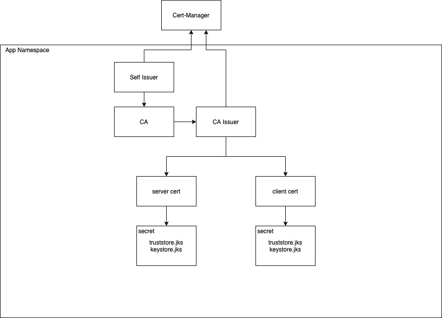
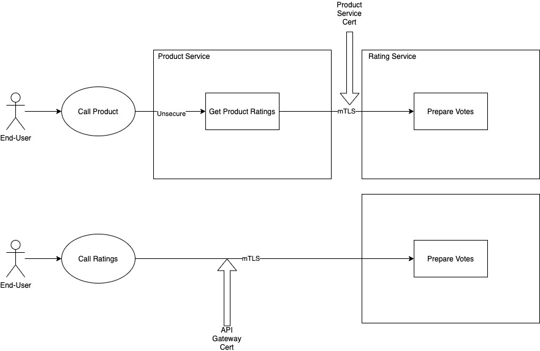

# mTLS Automation
This example shows how to generate all the required entities to automate all required aspects of the mTLS flow.

*. Creation of a selfissuer to generate a CA to sign all the mTLS certs with
*. Creation of the CA from the self issuer
*. Creation of client certs for both the api-gateway and product-service
*. Creation of server certs for the product-service
*. Configuration to mount the server and client certs from the secrets to the relevant pods



# Usage Demonstration
This demonstrates how to secure inner service communication and also external communication mTLS using cert-manager.  In the first example we demonstrate calling an unsecured endpoint (product-service) which then communicates to the rating-service using mTLS certs generated with cert-manager.  The second scenario demonstrates potentially the flow between an edge api gateway that secures communication with mTLS with its own api-gateway cert.



## End Client
Execute curl to the product service that is unsecure to products and mtls between products and rating services
1. Get route endpoint and set to an environment variable
    ```
    export ROUTE_HOST=$(oc get route product -o "jsonpath={.spec.host}")
    ```
1. Get the product and its votes
    ```
    curl http://$ROUTE_HOST/product/1
    ```
1. You should see the following
    ```
    {"id":1,"productName":"Test Product","votes":0}
    ```

## API Gateway mTLS
Execute curl (acting as an api gateway) to demonstrate securing a backend service with mTLS
1. Get route endpoint and set to an environment variable
    ```
    export RATING_HOST=$(oc get route rating -o "jsonpath={.spec.host}")
    ```
1. Get the ca and api gateway cert generated with cert manager and the self signed ca
    ```
    oc get secret api-gateway-example-com-tls -o "jsonpath={.data['ca\.crt']}" | base64 -D > ca.crt
    ```
1. Get the private key for the api-gateway
    ```
    oc get secret api-gateway-example-com-tls -o "jsonpath={.data['tls\.key']}" | base64 -D > tls.key
    ```
1. Get the public cert for the api-gateway
    ```
    oc get secret api-gateway-example-com-tls -o "jsonpath={.data['tls\.crt']}" | base64 -D > tls.crt
    ```
1. Execute the request with api-gateway cert
    ```
    curl --cacert ca.crt \
        --key tls.key \
        --cert tls.crt \
        --insecure \
        https://$RATING_HOST/rating/1
    ```